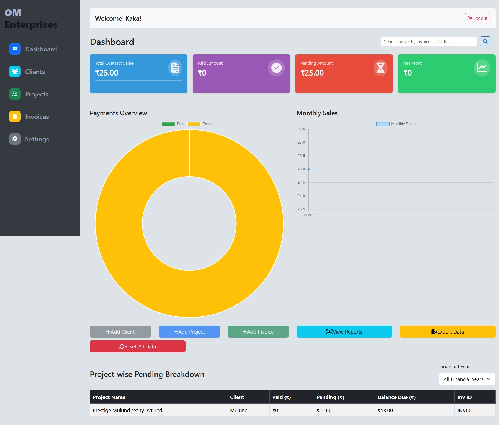
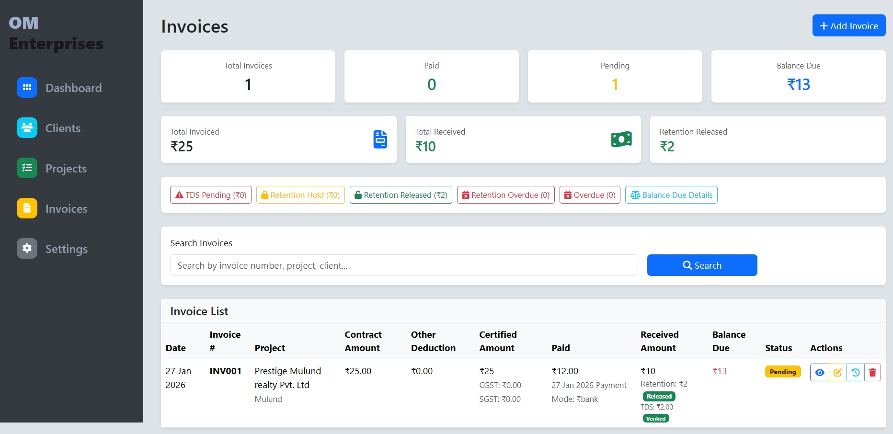

## 📄 Invoice Management System

This project focuses on **accurate financial calculations**, **clean UI dashboards**, and **practical invoice workflows** used in real-world enterprises.

---

## 🚀 Key Features

- Client & Project Management  
- Invoice creation with **RA Bill tracking**  
- GST calculation (**CGST / SGST**)  
- **TDS deduction & verification**  
- **Retention hold & release system**  
- Partial & multiple payments support  
- Real-time **balance due calculation**  
- Invoice preview & **PDF download**  
- Payment history with running totals  
- Dashboard analytics & charts  

---

## 🛠 Tech Stack

**Backend:** Python, Django  
**Frontend:** HTML, CSS, Bootstrap, Django Templates  
**Database:** SQLite (extendable to PostgreSQL / MySQL)  
**Charts:** Chart.js  
**Version Control:** Git & GitHub  

---

## 📊 Application Screenshots

### 📌 Dashboard Overview
Displays total contract value, paid amount, pending amount, profit, and visual analytics.



---

### 📌 Invoices Management
Complete invoice listing with payment status, retention, TDS, and balance due.



## ⚙️ Installation & Setup

1. Clone the repository  
   ```bash
   git clone https://github.com/your-username/your-repo-name.git
2. Navigate to the project directory
    cd your-repo-name
3. Create a virtual environment & activate it
    python -m venv venv
   venv\Scripts\activate   # Windows

4.  Install dependencies
       pip install -r requirements.txt
5. Run migrations
     python manage.py migrate
6. Start the development server
    python manage.py runserver
   
🎯 Use Case
Ideal for:
Real Estate Developers
Builders & Contractors
Construction Companies
Enterprises handling RA Bills & Retention Payments     
       
